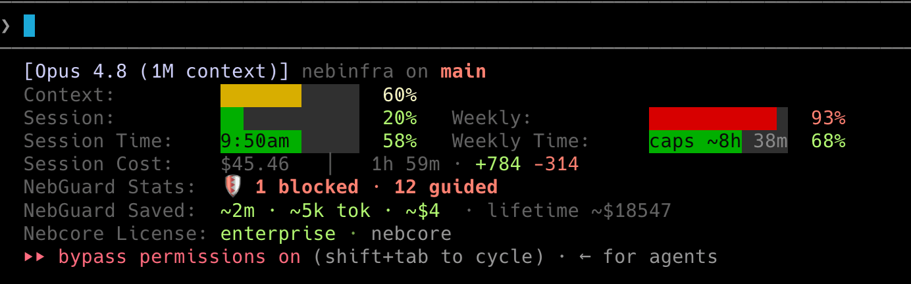
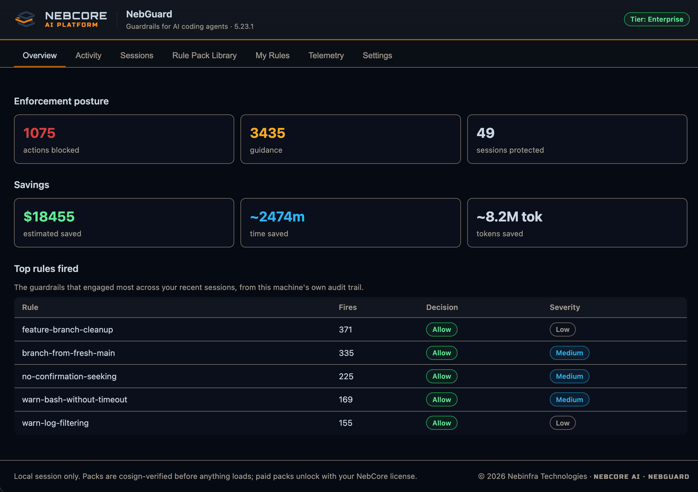
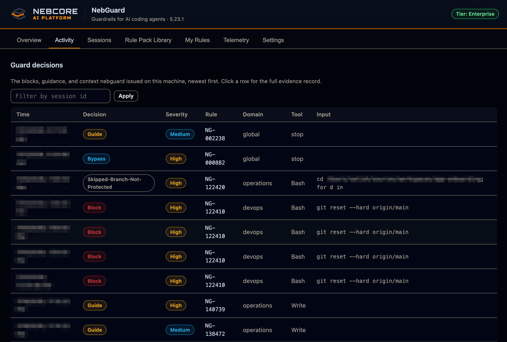
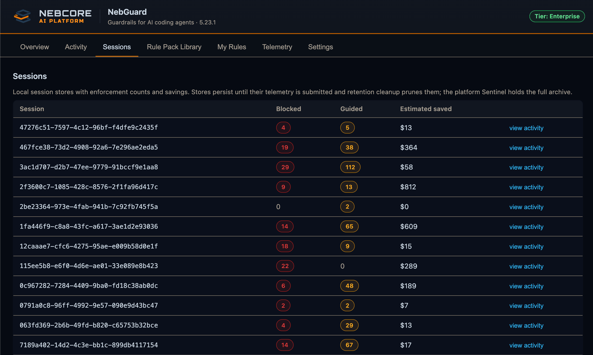
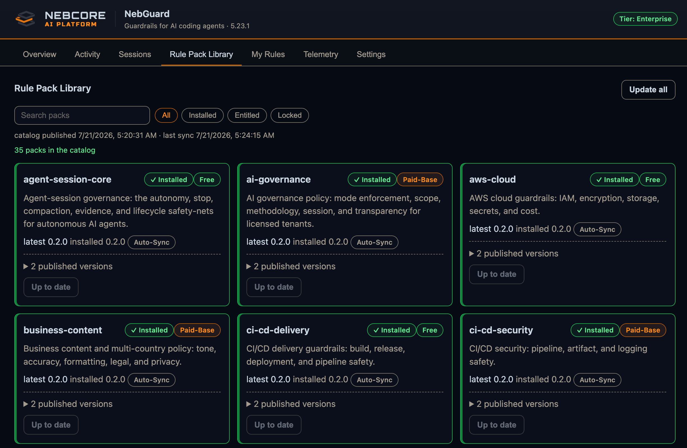
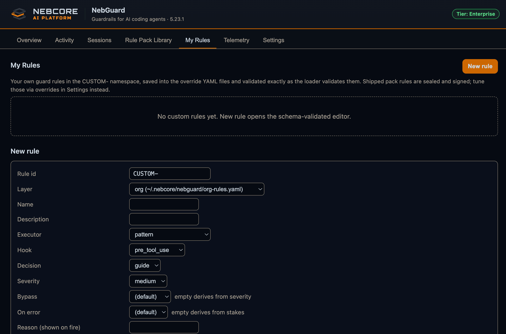
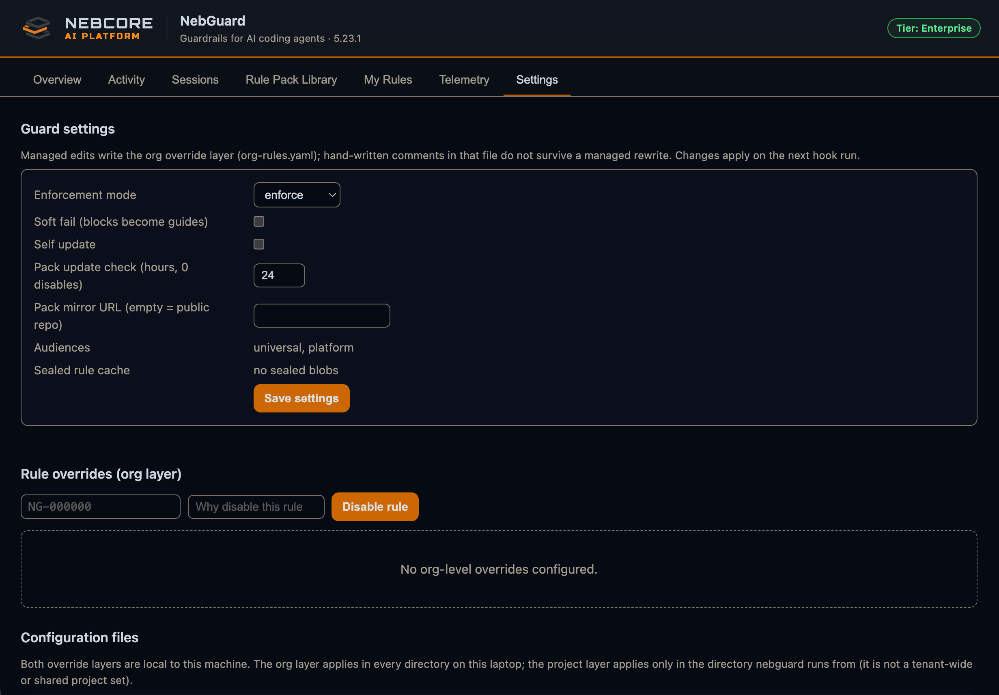

# NebGuard

**Policy-driven guardrails for AI coding assistants and autonomous agents.**



This repository hosts the signed binary releases of `nebguard`, the
NebCore AI guardrails engine. It governs both interactive coding-assistant
sessions and unattended autonomous-agent runs through the same hook engine.
**Claude Code and OpenAI Codex CLI are supported today**, with seven more
hook-capable assistants on the roadmap. See the
[support matrix](#supported-assistants-at-a-glance).

This README is self-contained: everything you need to install, verify, run,
and understand NebGuard is on this page. The same material, kept online and
searchable, lives at <https://docs.nebcore.ai/nebguard>.

---

## Table of contents

- [Why NebGuard](#why-nebguard)
- [What NebGuard does](#what-nebguard-does)
- [Supported assistants at a glance](#supported-assistants-at-a-glance)
- [Fail-safe by design](#fail-safe-by-design)
- [What it looks like when it fires](#what-it-looks-like-when-it-fires)
- [Screenshots](#screenshots)
- [Trust signals at a glance](#trust-signals-at-a-glance)
- [Install](#install)
  - [One-line installer (Linux / macOS / WSL2)](#one-line-installer-linux--macos--wsl2)
  - [Homebrew (macOS / Linux)](#homebrew-macos--linux)
  - [Scoop (Windows)](#scoop-windows)
  - [Direct download](#direct-download)
- [First-run setup](#first-run-setup)
- [What gets installed](#what-gets-installed)
- [Licensing and tiers](#licensing-and-tiers)
- [The rule domains](#the-rule-domains)
- [Rule packs](#rule-packs)
- [Define your own rules](#define-your-own-rules)
- [Telemetry and privacy](#telemetry-and-privacy)
- [Supported assistants](#supported-assistants)
  - [Claude Code](#claude-code)
  - [Codex CLI](#codex-cli)
- [Roadmap](#roadmap)
- [Command reference](#command-reference)
- [Verify a release](#verify-a-release)
- [Pinning for strict verifiers](#pinning-for-strict-verifiers)
- [Upgrades and rollback](#upgrades-and-rollback)
- [Air-gapped install](#air-gapped-install)
- [Troubleshooting](#troubleshooting)

---

## Supported assistants at a glance

NebGuard governs any assistant that exposes a command-hook lifecycle. The same
engine and the same rules run on every one. Enable with `nebguard setup <assistant>`.

| Assistant | Vendor | Status | Enable |
| --- | --- | --- | --- |
| **Claude Code** | Anthropic | ✅ Supported | `nebguard setup claude-code` |
| **OpenAI Codex CLI** | OpenAI | ✅ Supported (one-time hook trust) | `nebguard setup codex-cli` |
| GitHub Copilot CLI | GitHub | 🔜 Planned | — |
| Cursor | Anysphere | 🔜 Planned | — |
| Gemini CLI | Google | 🔜 Planned | — |
| opencode | opencode | 🔜 Planned | — |
| Continue | Continue | 🔜 Planned | — |
| Amazon Q Developer CLI | AWS | 🔜 Planned | — |
| Qwen Code | Alibaba | 🔜 Planned | — |

✅ ships and guards real work today. 🔜 is on the [roadmap](#roadmap), listed in
rough order of priority. Setup and per-assistant detail are in
[Supported assistants](#supported-assistants); want one prioritized or a new one
added? [Open an issue](https://github.com/nebinfra/nebguard-dist/issues).

---

## Why NebGuard

AI coding agents are fast and mostly correct, but a single bad action can be
expensive: a force-push to a protected branch, a deleted production resource,
a committed secret. A drifting agent is quieter but still costly, burning time
repeating itself or skipping verification. NebGuard catches the dangerous
actions before they run and keeps the agent pointed at the task, without
slowing down the normal ones. Think of it as a seatbelt and a co-pilot for your
agent: it prevents the crash, and it keeps you headed toward the destination. The
same engine and the same rules run on a developer laptop and inside an agent
pod in a cluster.

---

## What NebGuard does

NebGuard sits between your AI assistant and your machine. Every action
the assistant is about to take, running a command, editing a file,
reaching the network, finishing a turn, passes through a policy check
first. NebGuard responds in one of four ways:

- **Allow**: the action is fine; nothing happens.
- **Guide**: the action is risky; NebGuard adds a note so you and the assistant can reconsider.
- **Block**: the action is dangerous; NebGuard stops it before it runs.
- **Context**: NebGuard injects missing context (reminders, skipped verification steps) to keep the assistant on track, and restates key constraints after the assistant's context is compacted so the rules survive its own memory trimming.

It runs across the assistant's full hook lifecycle, before and after
every tool call, at session start and stop, on a prompt, and around
context compaction. Only the before-a-tool check can block an action;
the others observe, guide, inject context, or record. Every decision is written to
a tamper-evident, hash-chained audit log with the rule ID, the severity,
and any bypass marker that allowed a call through, so your team gets an
audit trail for compliance and security reviews.

Examples of what NebGuard catches:

- Block `git reset --hard` on `main`, `master`, and `release/*`.
- Block a commit that would leak a secret.
- Hold a session from ending until test-run evidence has been recorded.
- Steer the assistant back when it drifts off the task or repeats itself.

The rule library is data, not code, versioned and embedded in the
binary, so the guardrails behave identically offline and update
independently of the binary.

---

## Fail-safe by design

Two guarantees keep the guardrails trustworthy even when something goes wrong:

- **No self-bypass.** When a rule blocks a genuinely dangerous action, the assistant cannot disable that guard by writing its own justification. That class of guard is bypass-proof by design. Lower-stakes guides may still carry an explicit human override.
- **Fail closed where it counts.** If a high-stakes guard's own check errors out, it becomes a block rather than silently letting the action through. Observational and guide rules do the opposite: they fail open, so a glitch in a non-critical rule never wrongly blocks a legitimate action. The cost of being wrong decides the direction of failure.

---

## What it looks like when it fires

The exact wording depends on the rule and your environment; the shapes below
are representative, not literal.

**A blocked action.** NebGuard stops the action before it runs and explains
why. The assistant has to choose a safer path instead of executing it:

```text
BLOCKED  Destructive operation on a protected branch

  The agent attempted: git push --force origin main

  This would overwrite shared history on a protected branch.
  The action was stopped before it ran.

  Suggested next step: open a pull request, or push to a feature
  branch and request review.
```

A block is final for that action. For the highest-stakes guards, the assistant
cannot talk its way past the block by writing its own justification.

**A context note.** A context note does not stop anything. It adds context to keep
the assistant on course, for example reminding it of a step it skipped:

```text
CONTEXT  Verification step missing

  You changed application code but have not run the test suite.
  Run the tests and confirm they pass before marking this done.
```

Context injection is also how NebGuard restates key constraints after the assistant
trims its own context, so the rules that matter survive its memory management.

**A guide note.** A guide note flags a risky action without blocking it. The
assistant and the human both see the note and decide whether to proceed:

```text
GUIDE  Editing a generated file

  config.generated.yaml is produced by a build step.
  Hand edits here will be overwritten on the next build.
```

---

## Screenshots

NebGuard ships a local management UI. Run `nebguard serve` and it opens in your
browser, reading this machine's own audit trail and license state. It listens on
a loopback-only address with a per-launch URL token, so nothing is reachable from
another machine, and it leaves no daemon running once you stop it. The views below
are that dashboard.

**Overview: enforcement posture and savings at a glance.**



**Activity: every guard decision, newest first, each row a full evidence record.**



**Sessions: per-session enforcement counts and estimated savings.**



**Rule Pack Library: browse, install, and update rule packs by domain.**



**My Rules: author your own rules in a schema-validated editor.**



**Settings: enforcement mode, pack updates, and org-level overrides.**



---

## Trust signals at a glance

| Property | Implementation |
| --- | --- |
| Signing scheme | [Sigstore cosign](https://github.com/sigstore/cosign) with AWS KMS-backed **ECDSA P-256** keys |
| Key custody | Private key never leaves AWS KMS. Signing happens via the KMS API from production CI only. |
| Public key | <https://raw.githubusercontent.com/nebinfra/trust/main/cosign-keys/nebguard-prod.pub> |
| Transparency | Every signature is published to the public [Sigstore Rekor](https://rekor.sigstore.dev) transparency log. |
| Bundle format | Each artifact ships with a sibling `.bundle` containing the cosign signature plus the Rekor inclusion proof. |
| SBOM | An SPDX-JSON SBOM is attached to every release. |
| Mirror integrity | Each release artifact is byte-identical to the one signed at build time, so signatures verify here without re-signing. |
| Rotation | Quarterly automatic rotation (1st of Jan/Apr/Jul/Oct at 00:00 UTC). Old public keys remain at `nebinfra/trust/cosign-keys/archive/`. |

---

## Install

### One-line installer (Linux / macOS / WSL2)

```bash
curl -fsSL https://get.nebcore.ai/install | bash -s -- nebguard
```

The installer itself is cosign-signed; verify it before running on
production hosts using the same `cosign verify-blob` pattern shown in
"Verify a release" below. The installer's `.bundle` signature ships at
the same release-asset path as the binary.

After `nebguard` is on PATH, run `nebguard setup claude-code` to install
NebGuard as a Claude Code plugin and wire in the policy rules. That one
command registers the `nebinfra` plugin marketplace, installs the plugin
wrapper and hooks, places the binary where Claude Code expects it, and
writes a starter rule-override file on the first run. On Codex CLI, run
`nebguard setup codex-cli` instead; see
[Supported assistants](#supported-assistants) for the one extra trust step
Codex requires.

### Homebrew (macOS / Linux)

```bash
brew tap nebinfra/tap
brew trust nebinfra/tap
brew install nebguard
nebguard setup claude-code
```

The `brew trust` step is required once per machine: Homebrew 6.0 and later refuses to load formulae from taps outside the official Homebrew organization until you trust them.

### Scoop (Windows)

```powershell
scoop bucket add nebinfra https://github.com/nebinfra/scoop-bucket
scoop install nebguard
nebguard setup claude-code
```

### Direct download

```bash
VERSION=$(curl -fsSL https://api.github.com/repos/nebinfra/nebguard-dist/releases/latest | jq -r .tag_name)

# Assets use a lowercase OS and a Go-style arch. macOS ships one universal
# binary (arch "all"); Linux ships per-arch amd64 / arm64.
case "$(uname -s)" in
  Darwin) OS=darwin ARCH=all ;;
  Linux)  OS=linux
    case "$(uname -m)" in
      x86_64|amd64)  ARCH=amd64 ;;
      aarch64|arm64) ARCH=arm64 ;;
    esac ;;
esac
ASSET="nebguard_${VERSION#v}_${OS}_${ARCH}.tar.gz"
BASE="https://github.com/nebinfra/nebguard-dist/releases/download/${VERSION}"

curl -fsSL -o "$ASSET"        "$BASE/$ASSET"
curl -fsSL -o "$ASSET.bundle" "$BASE/$ASSET.bundle"
```

After verification (see below), extract and install:

```bash
tar -xzf "$ASSET"
sudo install -m 0755 nebguard /usr/local/bin/nebguard
nebguard setup claude-code
```

---

## First-run setup

The first time you run `nebguard setup claude-code`, NebGuard opens your
default browser to capture a one-time consent:

- **Email** and **name**: used to identify your installation and to send license-state notifications.
- **Terms & Conditions** and **Privacy Policy**: both required. Rejecting either aborts setup.
- **Help Us Improve**: an optional product-telemetry opt-in, off by default. Leaving it unchecked keeps every guardrail; your telemetry simply stays on the machine. See [Telemetry and privacy](#telemetry-and-privacy).

The form is served from a localhost loopback URL on a random port, so
nothing leaves your machine until you submit.

---

## What gets installed

The persistent footprint under `~/.nebcore/` is the same for every assistant;
only the hook wiring differs by host (a Claude Code plugin, or hooks in
`~/.codex/config.toml` for Codex CLI, as covered under
[Supported assistants](#supported-assistants)). Taking Claude Code as the
example, `nebguard setup claude-code` installs NebGuard as a Claude Code plugin
and:

- Backs up your Claude Code settings on the first run, then wires NebGuard into the assistant's hook lifecycle.
- Creates its home directory `~/.nebcore/nebguard/` for the parsed-rule cache, your installed rule packs, the local telemetry store (only if you opt in), and the per-session license state.
- After you accept at signup, writes your signed trial license, encrypted, to `~/.nebcore/license.enc`, the NebCore license file that NebCLI writes too.

Everything NebGuard keeps lives under `~/.nebcore/`, which on Windows is `%USERPROFILE%\.nebcore\` (for example `C:\Users\you\.nebcore\`):

| Path (macOS / Linux) | Path (Windows) | Contents |
| --- | --- | --- |
| `~/.nebcore/license.enc` | `%USERPROFILE%\.nebcore\license.enc` | your encrypted, signed license (read-only to NebGuard) |
| `~/.nebcore/nebguard/org-rules.yaml` | `%USERPROFILE%\.nebcore\nebguard\org-rules.yaml` | optional org-level rule and settings overrides |
| `~/.nebcore/nebguard/cache/` | `%USERPROFILE%\.nebcore\nebguard\cache\` | parsed-rule cache and per-session license state |
| `~/.nebcore/nebguard/packs/` | `%USERPROFILE%\.nebcore\nebguard\packs\` | your installed, signed rule packs (managed by `nebguard rules`) |
| `~/.nebcore/nebguard/telemetry/` | `%USERPROFILE%\.nebcore\nebguard\telemetry\` | the local telemetry store (written only if you opt in) |
| `<repo>/.nebguard-rules.yaml` | `<repo>\.nebguard-rules.yaml` | optional per-project rule overrides |

NebGuard resolves this home from your user profile, not from `%APPDATA%`,
so the entire persistent footprint sits under `%USERPROFILE%` on Windows.
While a session runs it also writes transient working files (extracted
rule assets and a per-session event database) under a
`nebguard-<session-id>/` folder in your operating system's temporary
directory: `$TMPDIR` on macOS and Linux, or `%LOCALAPPDATA%\Temp` on
Windows. Those are cleaned up when the session ends and are not part of
the persistent install.

Removal is symmetric:

```bash
nebguard uninstall
```

This restores your original assistant settings and removes the
`~/.nebcore/nebguard/` directory (`%USERPROFILE%\.nebcore\nebguard\` on
Windows).

---

## Licensing and tiers

**NebGuard is free to use, with no signup and no login.** A baseline set of
safety guardrails runs for everyone, forever, at zero cost. See
[The rule domains](#the-rule-domains) for how the rules are organized.

So without signing in to anything, NebGuard already blocks the dangerous
classics: a force-push or hard reset on a protected branch, a destructive
infrastructure change, an unsafe release step. These guardrails never expire.

### Try everything for 7 days

Every new install starts with a **7-day trial** at full capability. During the
trial the complete guardrail set is active, including both the subscription
and add-on rules, so you can see it all on your own work before deciding.

### Keep your guardrails after the trial

When the trial ends, the free baseline keeps firing exactly as before. The rest
steps down gracefully: rules beyond the baseline report `upgrade required` to
the assistant instead of firing, and your work is never blocked by their
absence.

To keep the licensed guardrails, **sign up for the NebCore AI Platform** at
<https://platform.nebcore.ai> and log in once:

```bash
nebcli login
```

That delivers your signed license to NebGuard automatically, and your
subscription rules reactivate at the start of your next session. Add-on packs,
such as the per-language and development packs, are a separate purchase on top
of a subscription. There is no separate `nebguard login`, and a subscription
that lapses simply falls back to Free.

| Tier | What you get | How to get it |
| --- | --- | --- |
| **Free** | The always-on baseline safety guardrails | Nothing to do; always on |
| **Trial** | Everything, including the subscription and add-on rules, for 7 days | Automatic on first install |
| **Subscription** | The baseline plus the NebCore AI Platform subscription rules | Sign up, then `nebcli login` |
| **Add-ons** | Extra specialized packs on top of a subscription | Purchase the add-on |

Your tier is read from a small, tamper-proof signed license. NebGuard carries
the matching public key and verifies it offline, so checking your tier never
requires the network. Only the platform can issue a valid license, so no one
can grant themselves a higher tier. The license is evaluated once at the start
of each session and held steady for that whole session, so any change takes
effect at your next session, never in the middle of one.

---

## The rule domains

Every rule is classified into one domain. Whether a given rule is active depends
on two independent things: your license tier (what you are entitled to) and
your environment (whether the rule even applies to where you are running). A
rule fires only when both checks pass.

| Domain | Covers |
| --- | --- |
| **`security`** | Auth, secrets, injection, cryptography, data protection, supply-chain |
| **`development`** | Code quality, API design, testing, documentation, per-language patterns |
| **`devops`** | CI/CD, releases, git workflow, containers, infrastructure, Kubernetes, GitOps |
| **`itsm`** | IT service management: change, incident, and service-request workflows |
| **`ai-governance`** | Agent autonomy, planning methodology, session discipline, transparency |
| **`business`** | Content tone and accuracy, region-specific legal and privacy rules |

---

## Rule packs

Rules ship as signed, versioned **packs** rather than baked into the binary, so
the guardrail library updates independently of `nebguard` itself. The catalog is
cosign-verified before anything loads, and your installed packs live under
`~/.nebcore/nebguard/packs/`. Most packs are free; the rest unlock with a paid
license.

Browse, install, and update packs from the command line:

```bash
nebguard rules search            # list the catalog (add a query to filter)
nebguard rules add <pack>        # install a pack from the catalog
nebguard rules update            # update installed packs to their latest versions
```

Packs added by the default sync stay current automatically; `nebguard rules pin
<pack>` holds one at its current version. You can also browse and manage the
whole library visually in the local dashboard with `nebguard serve` (see
[Screenshots](#screenshots)).

---

## Define your own rules

The built-in library covers the common cases, and you can add your own
rules on top. Custom rules go in either override file NebGuard already
reads:

- `<repo>/.nebguard-rules.yaml`, checked into a repo, applies to everyone who works in it.
- `~/.nebcore/nebguard/org-rules.yaml`, applies to every project on this machine.

For a fully commented starter file with a worked example for every
executor type, run:

```bash
nebguard setup claude-code --scaffold project   # or: org, or both
```

Each rule is one entry under `custom_rules:`. The skeleton:

```yaml
version: "1"

custom_rules:
  - id: CUSTOM-DBCLI           # custom IDs are CUSTOM- then letters, digits, and hyphens
    name: Block database CLI tools
    description: Prevent direct database access via psql, mongosh, or redis-cli
    executor: pattern          # how the rule evaluates, see the table below
    hook: pre_tool_use         # when it runs; only pre_tool_use can block
    decision: block            # block | guide | allow
    severity: high             # low | medium | high | critical
    config:                    # executor-specific settings
      patterns:
        - "\\bpsql\\b"
        - "\\bmongosh\\b"
        - "\\bredis-cli\\b"
    reason: "Use application tooling instead of direct database CLIs"
    l5_directive: "Block without asking"   # guidance handed to the assistant
    bypass_placement: inline-command       # where a REASON marker must sit to bypass this rule
    savings:                               # per-firing value shown in `nebguard stats`
      class: enforcement                   # advisory (0) | enforcement | preventive-high | preventive-critical
```

`savings.class` sets the value NebGuard credits a rule each time it fires,
so the stats and status-line savings row report a realistic number rather
than a flat severity guess. It is optional for your own rules (a `block`
defaults to `enforcement`, a `guide` to `advisory`), but setting it makes the
estimate honest: a nudge that prevents nothing stays `advisory` (worth 0),
a block that averts a real footgun is `preventive-high`, and one that averts
a catastrophe such as a leaked credential is `preventive-critical`. Add
`recovery_tokens`, `engineer_minutes`, or `incident_usd` under `savings:` to
override the class base for a specific rule. Every built-in rule already
carries one.

Each firing is valued as three parts summed into the dollar figure: the AI
tokens to detect and redo the action, the engineer time to notice and fix
it, and, for the preventive classes, an averted-incident (blast-radius)
cost, the downstream damage a prevention avoids, such as rotating a leaked
credential or recovering a deleted production resource. That incident cost
is scaled by the environment the blocked action would have hit, resolved per
decision from the git ref or command target (production at full value,
staging and development at a fraction), so a prevented production change and
the same change in a scratch environment are not priced the same. NebGuard
reads that target from the action itself; it never asks the assistant to
declare it. Tune the rates and the per-environment factors under
`settings.savings`, and run `nebguard stats --explain` to see the live
model.

The `executor` decides how a rule fires; each reads its own `config:` block:

| Executor | Fires on |
| --- | --- |
| `pattern` | a tool call matching a regex, to block or guide a command |
| `content-analysis` | written file content matching a pattern, for example a leaked key |
| `rate-limiter` | an action repeating too often within a time window |
| `state-gate` | a required earlier step that has not happened, for example tests before a push |
| `session-monitor` | a whole-session signal, for example the final assistant message claiming done without evidence |
| `confidence-gate` | the assistant's confidence sitting below a bar for a risky action |
| `context-injector` | nothing to block; it injects reminders or restates constraints (the Context behavior) |

Rules run across the assistant's hook lifecycle (`pre_tool_use`,
`post_tool_use`, `session_start`, `stop`, `prompt`, and the compaction
hooks); only `pre_tool_use` can block. Project rules take precedence over
org-level rules, which take precedence over the built-in library. NebGuard
reloads the override files on the next action, so a change takes effect
without a restart. The fail-safe guarantees still apply to overrides: the
highest-stakes guards cannot be silenced away, and a critical guard that errors
out still fails closed.

---

## Telemetry and privacy

The **Help Us Improve** opt-in (off by default, chosen at first-run
setup) lets NebGuard send sanitized product telemetry to NebCore AI so
we can see which rules are useful, which produce false positives, and
where the product needs work.

**Your choice is honored on your own machine.** If you leave it
unchecked, NebGuard transmits nothing: the data is never collected for
sending and never leaves your machine. Full guardrails stay active
either way; the opt-in changes only whether anonymized usage data is
shared. Your choice is recorded locally at
`~/.nebcore/nebguard/telemetry-consent.json` (on Windows,
`%USERPROFILE%\.nebcore\nebguard\telemetry-consent.json`).

**What gets sent (opt-in only)**: per-decision metadata, namely
`rule_id`, `decision` (allow / guide / block), `category`, `severity`, a
short `rule_version` hash, and a batch ID for dedup. The full schema is
at [platform.nebcore.ai/legal/telemetry](https://platform.nebcore.ai/legal/telemetry).

**What is never sent**: your code, AI prompts or responses, command
arguments, file paths, environment variables, secrets, audit-log
contents, or IP addresses. Any personal details you provide at signup are
used only to issue and support your license. They are never cross-referenced
with telemetry and never used for marketing or model training.

---

## Supported assistants

NebGuard behaves the same across every supported assistant. Each is enabled with
`nebguard setup <assistant>` and removed with `nebguard uninstall [--host <assistant>]`.

| Assistant | Vendor | Status | Setup command | Configure |
| --- | --- | --- | --- | --- |
| [Claude Code](#claude-code) | Anthropic | Supported | `nebguard setup claude-code` | None |
| [Codex CLI](#codex-cli) | OpenAI | Supported | `nebguard setup codex-cli` | One-time hook trust |

Support for more hook-capable assistants is on the [roadmap](#roadmap).

### Claude Code

`nebguard setup claude-code` registers the public `nebinfra/claude-plugins`
marketplace, installs the NebGuard plugin (wrapper and hooks), places the binary
where Claude Code expects it, and writes a starter rule-override file on the
first run. Claude Code trusts plugin hooks when the plugin installs, so nothing
else is required: NebGuard is active for every session on this machine. Remove it
with `nebguard uninstall`.

### Codex CLI

`nebguard setup codex-cli` places the binary at `~/.codex/bin/nebguard` and merges
a NebGuard hook block into `~/.codex/config.toml`, preserving your existing
config. It needs the Codex CLI already installed (a `~/.codex` directory).

Codex runs a command hook only after you **trust** it, so setup adds one explicit
step. It prints an `ACTION REQUIRED` block and, in an interactive terminal, waits
while you:

1. Run `codex`.
1. Type `/hooks`.
1. Review and **Trust** every NebGuard hook (all listed events).
1. Exit Codex and return to the setup prompt.

Setup re-checks and reports `NebGuard is active for Codex` once the trust is
recorded. Until then, Codex silently skips the hooks and NebGuard is not guarding
Codex, so always finish the trust step. If you install non-interactively (in CI,
or with no terminal), setup prints a warning instead of waiting; trust the hooks
via `/hooks`, then re-run `nebguard setup codex-cli` to verify. Remove it with
`nebguard uninstall --host codex-cli`.

---

## Roadmap

NebGuard is production-ready today. The guardrail engine, signed releases,
licensing, the installable rule-pack library and registry, custom rules, and
the tamper-evident audit trail described above all ship now and guard real
work. The roadmap below is where we take it next, adding reach and depth on
top of that stable core.

| Capability | What it adds |
| --- | --- |
| **More assistants** | Claude Code and Codex CLI are supported today. Planned, in rough order of popularity: GitHub Copilot CLI, Cursor, Gemini CLI, opencode, Continue, Amazon Q Developer CLI, and Qwen Code. |
| **Rule authoring and testing kit** | Dry-run a rule against sample commands and files, and lint a pack before you ship it, so writing your own rules and contributing packs is fast and safe. |
| **Team and organization policy packs** | Publish one governed rule set for your organization and have every member's NebGuard pull it automatically, so a whole team shares the same guardrails with no hand-configuration. |
| **Compliance evidence and reports** | Turn the tamper-evident audit log into exportable reports mapped to common frameworks such as SOC 2, ISO 27001, and HIPAA, so the decisions NebGuard already records become audit-ready evidence. |

Want a pack, a host, or a capability prioritized? Open an issue on this
repository.

---

## Command reference

Day to day you run only a handful of commands. The guardrail checks
themselves run automatically: your assistant invokes them through the hooks
that `setup` installs, so you never call those by hand.

| Command | What it does |
| --- | --- |
| `nebguard setup claude-code` | Install NebGuard for Claude Code (plugin and hooks). Run `nebguard setup --help` to see which assistants are supported. |
| `nebguard setup codex-cli` | Install NebGuard for Codex CLI (hooks in `~/.codex/config.toml`), then guide you through the one-time `/hooks` trust step. |
| `nebguard uninstall` | Remove NebGuard from Claude Code and restore your original settings. |
| `nebguard uninstall --host codex-cli` | Remove the NebGuard hook block and binary from Codex CLI. |
| `nebguard version` | Print the version, your license tier and entitled packs, and the embedded SBOM. |
| `nebguard telemetry status` | Show what product telemetry is queued, submitted, or withheld locally. Read only; nothing is sent. |
| `nebguard serve` | Open the local dashboard (guard posture, activity, sessions, savings, and the rule-pack library) in your browser. Loopback-only, no daemon. |
| `nebguard stats` | Show what NebGuard has saved (time, tokens, and cost). Add `--explain` for the per-event math. |
| `nebguard rules search` / `add` / `update` | Browse the pack catalog, install a pack, and update installed packs. See [Rule packs](#rule-packs). |

Common flags on `setup claude-code`: `--no-update` (install the binary
you already have instead of fetching the latest release), `--force`
(overwrite an existing install), and `--consent-timeout=15m` (lengthen
the first-run consent window).

### Example: inspect the binary you installed

`nebguard version` reports the build provenance, your license tier and
entitled packs, and the full dependency SBOM compiled into the binary
(the same SBOM published alongside the release):

```text
$ nebguard version
NebGuard 1.2.3
  Commit:    a1b2c3d
  Built:     2026-01-15T09:30:00Z
  Go:        go1.26.4
  Platform:  darwin/arm64
  Compiler:  gc

License:
  Tier:            free
  Entitled packs:  core, git-workflow, kubernetes-platform, ... (the packs your license unlocks)

Legal:
  © 2026 Nebinfra Technologies. All rights reserved.
  NebGuard is proprietary software; use is governed by the Terms of Service.
  Terms:      https://platform.nebcore.ai/legal/terms
  Privacy:    https://platform.nebcore.ai/legal/privacy
  Telemetry:  https://platform.nebcore.ai/legal/telemetry

SBOM (Dependencies):
  github.com/spf13/cobra@v1.10.2
  ... one line per embedded dependency ...

Build Settings:
  CGO_ENABLED=0
  GOARCH=arm64
  GOOS=darwin
  vcs.revision=a1b2c3d9e8f7
  vcs.time=2026-01-15T09:30:00Z
  vcs.modified=false
```

---

## Verify a release

You need [`cosign`](https://github.com/sigstore/cosign#installation) v2 or later.

```bash
cosign verify-blob \
  --bundle nebguard_<version>_<os>_<arch>.tar.gz.bundle \
  --key https://raw.githubusercontent.com/nebinfra/trust/main/cosign-keys/nebguard-prod.pub \
  --rekor-url https://rekor.sigstore.dev \
  nebguard_<version>_<os>_<arch>.tar.gz
```

A successful run prints `Verified OK`. Any other output, or a non-zero
exit code, means the artifact is not authentic, so **do not run it**.

---

## Pinning for strict verifiers

Strict verifiers should pin the public key URL to a specific
`nebinfra/trust` commit SHA:

```bash
cosign verify-blob \
  --bundle nebguard_<version>_<os>_<arch>.tar.gz.bundle \
  --key https://raw.githubusercontent.com/nebinfra/trust/<commit-sha>/cosign-keys/nebguard-prod.pub \
  --rekor-url https://rekor.sigstore.dev \
  nebguard_<version>_<os>_<arch>.tar.gz
```

Re-pin only when a legitimate key rotation is announced via the
`nebinfra/trust` GitHub Releases feed.

---

## Upgrades and rollback

The installer is idempotent. To upgrade:

```bash
curl -fsSL https://get.nebcore.ai/install | bash -s -- nebguard
nebguard setup claude-code --no-update    # refresh hooks if the rule schema changed
```

To pin to a specific version:

```bash
curl -fsSL https://get.nebcore.ai/install | bash -s -- nebguard --version v1.2.3
```

To roll back, install the previous tag the same way. Historical tags are
immutable.

---

## Air-gapped install

NebGuard works in environments isolated from the public internet, where the
platform backend runs locally. It behaves exactly as it does when connected:
rule evaluation, license verification, and decryption all happen inside the
binary with no network, and license delivery, signup, and telemetry resolve to
the local backend. There is no degraded mode. The only practical difference is
how the binary is delivered.

Mirror the release artifacts plus the public key into your internal
artifact store:

- `nebguard_<version>_<os>_<arch>.tar.gz`
- `nebguard_<version>_<os>_<arch>.tar.gz.bundle`
- `nebguard_<version>_<os>_<arch>.tar.gz.intoto.jsonl`
- `SHA256SUMS`
- `cosign-keys/nebguard-prod.pub`

`cosign verify-blob --bundle ... --key <local-pub-file>` works offline.
The bundle's embedded Rekor inclusion proof is checked against the
bundle's own contents, so no Rekor network round-trip is needed.
Re-verify against an in-network Rekor mirror periodically as a
tamper-evidence audit. Install the mirrored binary with `nebguard setup
claude-code --no-update`, which never reaches the public update channel.

---

## Troubleshooting

| Symptom | What to do |
| --- | --- |
| `claude CLI not found` or `~/.claude not found` during setup | Install Claude Code first, then re-run `nebguard setup claude-code`. NebGuard wires into an existing Claude Code install; it does not install the assistant for you. |
| `~/.codex not found` during `setup codex-cli` | Install the Codex CLI first, then re-run `nebguard setup codex-cli`. NebGuard wires into an existing Codex install; it does not install the assistant for you. |
| Codex setup finished but NebGuard is not guarding Codex | Codex skips a command hook until you trust it. Run `codex`, type `/hooks`, and Trust every NebGuard hook, then re-run `nebguard setup codex-cli` to verify. Setup prints `NebGuard is active for Codex` once trust is recorded. |
| The consent browser tab never opened | Setup prints a `http://127.0.0.1:<port>/...` URL. Open it in any browser on the same machine. On a headless or SSH host, forward that port, or run setup where a browser is available. |
| Setup finished but paid-tier rules are not firing | Registration probably did not complete (setup prints a warning). Re-run `nebguard setup claude-code`; a registration queued during a network blip is replayed automatically. Confirm you have run `nebcli login`, since your tier is delivered through it. |
| Running in CI or over SSH with no terminal | Setup detects a non-interactive shell and installs at the Free tier, since the browser consent is a standalone-install step. Re-run it in an interactive terminal to capture consent. |
| Rules report `upgrade required` | Expected after the trial ends without a paid license, or for a public Free user. Acquire a license, then start a new session: NebGuard reads license state once per session. |
| `nebguard: command not found` (macOS / Linux) or `'nebguard' is not recognized` (Windows) | The install directory is not on your `PATH`. On macOS or Linux, confirm `/usr/local/bin` (direct install) or your Homebrew prefix is on `PATH`. On Windows, confirm the Scoop shims directory (`%USERPROFILE%\scoop\shims`) is on `PATH`, then open a new terminal so the updated `PATH` applies. |
| `cosign verify-blob` prints anything other than `Verified OK` | Do not run the artifact. Re-download it with its `.bundle`, and confirm you are using the correct public key (see [Verify a release](#verify-a-release)). |
| Need to repair or reset an install | `nebguard setup claude-code --force` overwrites an existing install; `nebguard uninstall` removes NebGuard and restores your original settings. |

When filing a bug report, include the output of `nebguard version` (build,
license, and SBOM details) and `nebguard telemetry status`
(local queue state). Neither command transmits anything.
